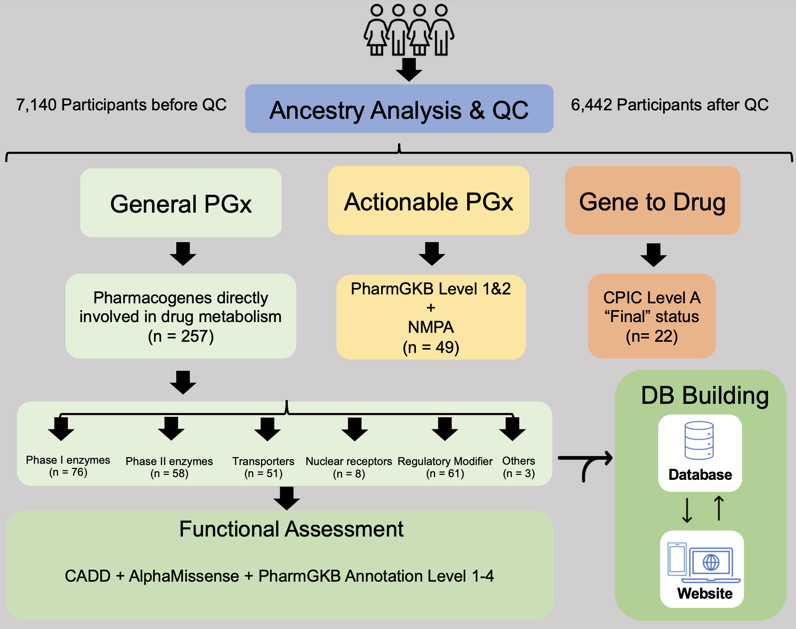
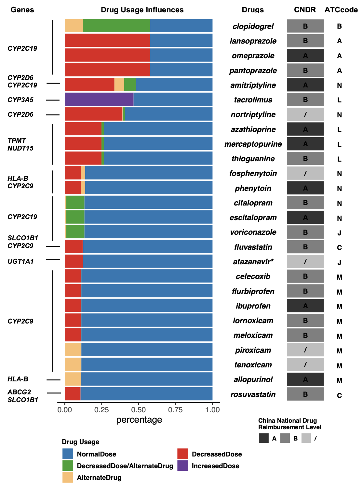
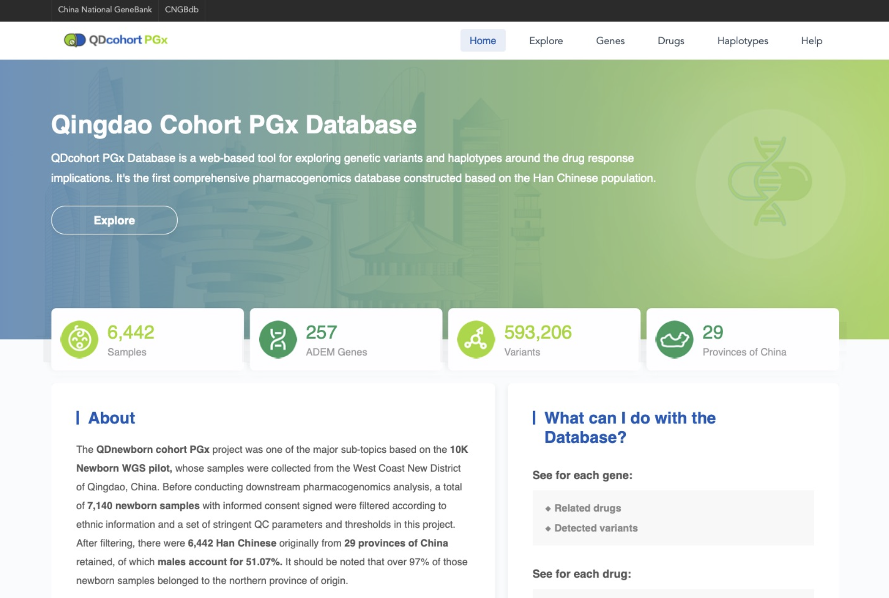

# Qingdao Newborn Cohort PGx Study

This folder contains information, scripts and data files that generated from and support the Qingdao Newborn Cohort pharmacogenomics study.

## Important Comments
1. This study does not provide any individual level genotype data for public access. VCF file containing population level genetic variation frequency data have been stored in the CNGB Sequence Archive of CNGBdb under accession number CNP0004887.
2. Population level variation data and coresponding model prediction data have also been stored and presented in the Qingdao Newborn Cohort PGx database (https://db.cngb.org/QDPGx) via the CNGBdb (China National GeneBank database) platform.
3. The reference genome assembly untillized in this study is hg38/GRCh38.

## Brief Findings in our PGx Study
The QDnewborn cohort study was approved by the Research Ethics Committee of Qingdao Women and Children's Hospital (ethical permit ID: QFELL-KY-2020-29) and the Instituted Review Board of Bioethics and Biosafety of BGI (BGI-IRB, ethical permit ID: BGI-IRB 20064). 

7,140 individuals were recruited from 9,992 newborn children at Maternal and Child Health Hospital of Huangdao District, and Maternal and Child Health and Family Planning Service Center of Huangdao District in Qingdao, China. Written informed consent was obtained from the parents. Heel blood samples were obtained and whole genome sequencing were performed. Self-reported demographic information was collected from the parents.

After QC, 6,442 Han Chinese individuals (48.93% females) were retained. The sequencing depth of 6,442 participants distributed within the range from 30.89X to 206.08X with the median of 61.75X. According to the paternal place of origin, 97% of the participants were Northern Chinese. 84% of them originated from Shandong province.

To comprehensively profiling the pharmacogenetic pattern of our Qingdao newborn cohort, we designed an analysis pipeline consisting of five main parts, illustrated as the flowchart. These five main parts were:

(1) characterizing genetic variants in 257 pharmacogenes; 
(2) assessing the functionality of these PGx variants; 
(3) developing a web-based database for presenting these PGx variants; 
(4) investigating known actionable PGx variations within PharmGKB annotation levels 1 and 2;
(5) evaluating the influence of genotype on the administered drug dosage based on the CPIC guidelines.

The stacked barplot above is CPIC level A guidance-based non-typical drug response predictions result with impact on over 10% populaions corresponding to both pediatric and adult populations. Pharmacogenes relevant to the drug are indicated. Influence of genotyps on drug usage at the population level, following CPIC level A guidance, is depicted as stacked bars. The level of reimbursement for corresponding drugs in the China National Drug Reimbursement list is indicated on the right in grayscale. Additional information on the Anatomical Therapeutic Chemical (ATC) classification system for corresponding drugs and the specific organ or system that they target is labeled on the rightmost as well.

The screenshot above is the homepage of our Qingdao newborn cohort PGx database. In total, 593,206 genetic variants from 257 genes related to 946 drugs, along with functional prediction data based on our Qingdao newborn cohort, have been summarized in this DB.

